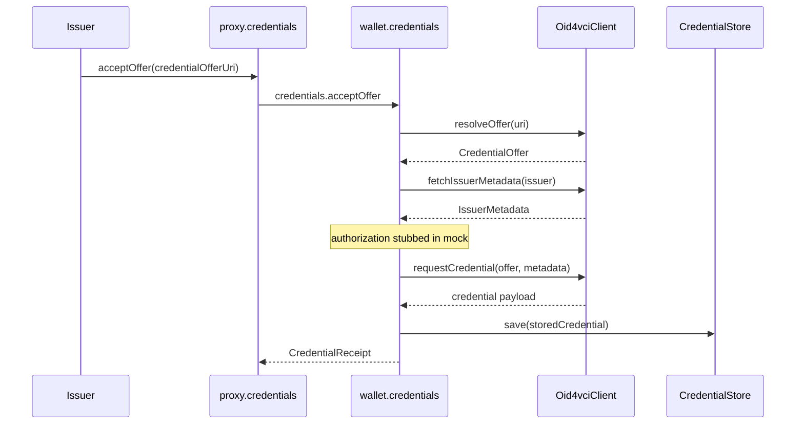

# OID4VCI flow — Issuer → Wallet

Maps the [OpenID for Verifiable Credential Issuance](https://openid.net/specs/openid-4-verifiable-credential-issuance-1_0.html) pattern to OWS abstractions. The stub uses `MockOid4vciClient`; a production wallet swaps in an HTTP client behind `Oid4vciClient`.

## Sequence



## `Oid4vciClient` interface

| Method | OID4VCI step |
|--------|----------------|
| `resolveOffer(uri)` | Parse credential offer (URI or QR) |
| `fetchIssuerMetadata(issuer)` | `/.well-known/openid-credential-issuer` |
| `requestCredential(offer, metadata)` | Token + credential endpoint exchange |

## Entry point

Host apps trigger issuance via:

```ts
await proxy.credentials.acceptOffer({
  credentialOfferUri: CredentialOfferUri("mock://kyc-offer/demo"),
});
```

## Stub behavior

- `mock://` URIs resolve to fixtures in `examples/shared`
- No HTTP, OAuth, or proof-of-possession in the stub phase
- Real integration: add HTTP client implementing `Oid4vciClient`, wire in `credentials-provider` registry module
