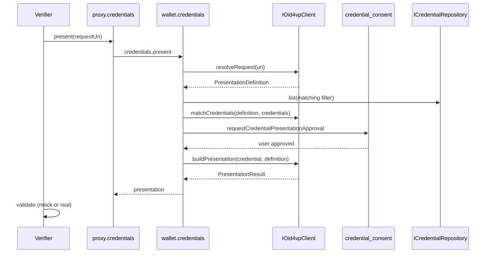

# OID4VP flow — Verifier → Wallet → Verifier

Maps the [OpenID for Verifiable Presentations](https://openid.net/specs/openid-4-verifiable-presentations-1_0.html) pattern to OWS abstractions. The stub uses `MockOid4vpClient`.

## Sequence



## `IOid4vpClient` interface

| Method | OID4VP step |
|--------|-------------|
| `resolveRequest(uri)` | Parse presentation request |
| `matchCredentials(definition, credentials)` | Find satisfying credentials |
| `buildPresentation(credential, definition)` | Selective disclosure + response |

## Consent

Before `buildPresentation`, the wallet must show the verifier identity and requested claims via `UiHost.requestCredentialPresentationApproval` (implemented by the `credential-consent` registry module).

## Entry point

```ts
const result = await proxy.credentials.present({
  requestUri: PresentationRequestUri("mock://kyc-presentation/demo"),
  acceptedIssuers: [CredentialIssuer("https://kyc.demo.issuer.example")],
});
```

## Stub behavior

- Demo presentations are real SD-JWT VC with `kb+jwt`
- Verifier demo validates against `KycProfilePolicy` + host `acceptedIssuers` / wallet `IIssuerTrustRegistry` mocks
- Real integration: DCQL/presentation exchange per OID4VP (Phase 4)
